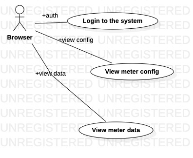
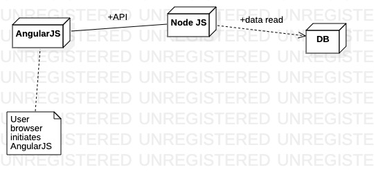
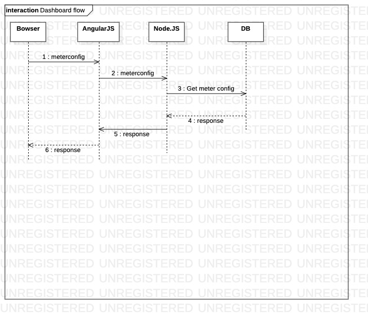
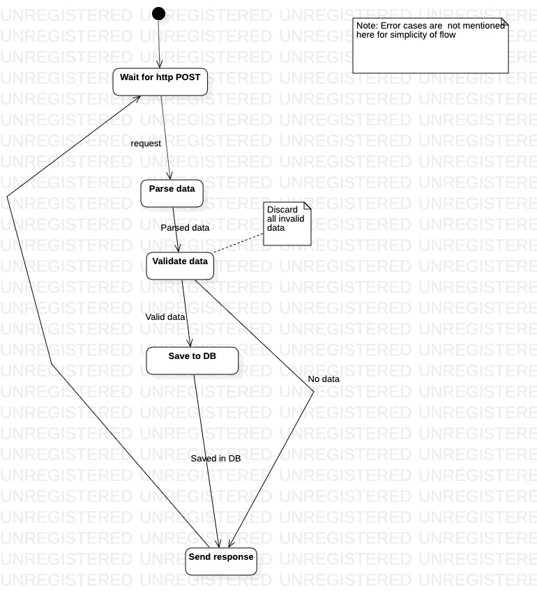

<!-- vscode-markdown-toc -->
* 1. [Abbreviation and definitions](#Abbreviationanddefinitions)
* 2. [Vision](#Vision)
* 3. [Requirements break-down](#Requirementsbreak-down)
	* 3.1. [Functional requirements](#Functionalrequirements)
		* 3.1.1. [Data upload](#Dataupload)
		* 3.1.2. [Data visualization](#Datavisualization)
	* 3.2. [Non-functional requirements](#Non-functionalrequirements)
	* 3.3. [Non-requirements](#Non-requirements)
* 4. [Visualization design flow](#Visualizationdesignflow)
	* 4.1. [Visualization use-case](#Visualizationuse-case)
		* 4.1.1. [Below use-case talks about meter data fetch](#Belowuse-casetalksaboutmeterdatafetch)
	* 4.2. [Dashboard Deployment diagram](#DashboardDeploymentdiagram)
	* 4.3. [Dashboard sequence diagram](#Dashboardsequencediagram)
* 5. [Data upload design flow](#Datauploaddesignflow)
	* 5.1. [State machine diagram for upload request by client (IOT device)](#StatemachinediagramforuploadrequestbyclientIOTdevice)

<!-- vscode-markdown-toc-config
	numbering=true
	autoSave=true
	/vscode-markdown-toc-config -->
<!-- /vscode-markdown-toc -->

# 1. Smartfi server system
##  1. Abbreviation and definitions
*  Client -> IOT device which posts meter data to server

##  2. Vision
Smartfi system enables multiple IOT devices to send its data to common server. This data will be used to visualize and troubleshoot IOT devices under consideration

##  3. Requirements break-down
###  3.1. Functional requirements
####  3.1.1. Data upload
* A client(IOT device) should be able to upload data periodically
* A client(IOT device) should be able to retry data upload
* Client(IOT device) can upload data in different scaling of units. Server should normalize them in SI scaling of unit before storing to DB
* A client(IOT device) may provide data timestamp and in this case, system should use the same. 
    * Timestamp will be in UNIX format (number of epochs)
    * System will store data marking timestamp, if needed. Timestamp granuality is minute
* Multiple client(IOT device) should be able to upload data concurrently
* System should store data in such a way that consumer can distinguish among data for each source (client IOT device)
* Only registered client should be able to interact with system
* System must validate data before storing to the DB. Out of data bunch in a POST request, 
    * If all data are valid, then system should store all of them in DB and return "ACK" to the client(IOT device)
    * If atleast one data is valid, then system should store only valid data in DB and return "ACK" to the client(IOT device) 
    * If there is no valid data in request, then return "NCK" and no-op to DB
    * If there is no data in request, then send "ACK" and no-op to DB

####  3.1.2. Data visualization
* System should be able to generate report and send it via Auto-mail
* Requirement for backend Auto-mail reports (with miximum, minimum & average) with charts:- Lists of report types
    * Energy vs cost :-
        * Energy vs cost data of different meters (Energy Vs Cost Report)
        * Energy Generation (Chart-Generation Energy Vs Cost)
        * Energy Consumptions (Chart-Consumption Energy Vs Cost)
    * Daily Energy Data(i.e. 24hr consumption) with graph
    * Log Book of energy cnsumptions with graph:-
        * 15-minutes (Logbook15Minutes)
        * 30-minutes (Logbook30Minutes)
        * Hourly (LogbookHourly)
    * Group wise Energy Report with chart (Group Report)
    * Shift Energy Report :-
        * with cost
        * without cost
* Frontend Energy report tree
    * Energy Cost
        * Without Cost
            * Periodic 
                * 1-Minute
                * 15-Minute
                * 30-Minute
                * 60-Minute
            * Daily
            * Monthly
            * Yearly
            * Group Energy
            * Shift Energy Report
        * With Cost
            * Periodic 
                * 1-Minute
                * 15-Minute
                * 30-Minute
                * 60-Minute
            * Daily
            * Monthly
            * Yearly
            * Group Energy
            * Shift Energy Report

###  3.2. Non-functional requirements
* Server should be fair in processing multiple client data upload. Upload should be reasonably fast and there should not be any starvation
* Client should not wait while uploading data 
* Client should get success or failure for its request
* Data upload should be atomic (all or none). For multiple data POST,
    * If all data store to DB is successful, then return ACK to client (IOT device)
    * If data store to DB fails, then return NCK to client (IOT device)
* Server should handle  malformed data upload request gracefully and it should not impact availability
* System should be able to cleanup old data(more than 5 years old) so that DB will not overflow. User should be able to configure this value.

###  3.3. Non-requirements
* Edit of data which is already uploaded is not considered
* Timestamp granuality more than minute is not considered

##  4. Visualization design flow

###  4.1. Visualization use-case
####  4.1.1. Below use-case talks about meter data fetch

###  4.2. Dashboard Deployment diagram

###  4.3. Dashboard sequence diagram

##  5. Data upload design flow
###  5.1. State machine diagram for upload request by client (IOT device)
* Server waits for request
* Once request comes, it first parses it
* It validates data and removes all invalid data
* Server stores valid data to DB
* At end, server sends response to client according (ACK/NCK) to processing result

